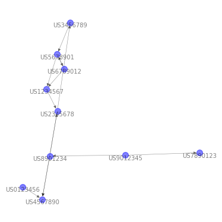

# TechFlow
## Installation

`pip install git+https://github.com/lee-ju/techflow.git`

> ## Usage

> > #### IPC Code Network
```python
from techflow.nx_tech import nx_preps, nx_utils
import pandas as pd

## Read dataset
sample_ipcs = pd.read_csv('sample_dataset/sample_ipc.csv')
ipcs = sample_ipcs['all_ipcs'].tolist()

## Preprocessing
ipcs_preps = nx_preps(ipcs)
ipcs_df = ipcs_preps.edges(obj='ipcs', num_slice=4, spliter='||')

## Network Centrality
ipcs_utils = nx_utils(ipcs_df, direct=False)
ipcs_central = ipcs_utils.nx_centrality(top_k=3)
print(ipcs_central)

## Visualizing
    ipcs_G = ipcs_utils.nx_viz(fs=[5, 5], with_labels=True,
                           font_size=10, font_color='blue',
                           node_size=100, node_color='red', seed=15)
```
```python
[Out]:

100%|██████████| 20/20 [00:00<00:00, 63453.92it/s]
        Degree  Closeness  Betweenness  Centrality
id                                                
G06F  0.375000   0.421053     0.721014    1.517067
G02B  0.250000   0.296296     0.369565    0.915862
H04Q  0.083333   0.352941     0.391304    0.827579
```


> > #### Citation Network
```python
from techflow.nx_tech import nx_preps, nx_utils
import pandas as pd

## Read dataset
sample_forws = pd.read_csv('sample_dataset/sample_forw.csv')
apps = sample_forws['Reg_id'].tolist()
forws = sample_forws['Forw_in_id'].tolist()

## Preprocessing
forws_preps = nx_preps(x=apps, y=forws)
forws_df = forws_preps.edges(obj='forws', num_slice=0, spliter='||')

## Network Centrality
forws_utils = nx_utils(forws_df, direct=False)
forws_central = forws_utils.nx_centrality(top_k=5)
print(forws_central)

## Visualizing
    forws_G = forws_utils.nx_viz(fs=[5, 5], with_labels=True,
                             font_size=10, font_color='black',
                             node_size=100, node_color='blue', seed=15)
```
```python
[Out]: 

100%|██████████| 10/10 [00:00<00:00, 108660.73it/s]
             Degree  Closeness  Betweenness  Centrality
id                                                     
US2345678  0.444444   0.363636     0.236111    1.044192
US5678901  0.444444   0.285714     0.152778    0.882937
US6789012  0.555556   0.210526     0.000000    0.766082
US4567890  0.333333   0.418301     0.000000    0.751634
US1234567  0.333333   0.250000     0.111111    0.694444
```


> > #### Patents with Indirect Connection (see [Paper](https://doi.org/10.3390/su13020820))

```python
from techflow.pic import pic_preps, pic_utils
import pandas as pd

## Read dataset
sample_pic = pd.read_csv('sample_dataset/sample_pic.csv')
apps = sample_pic['Reg_id'].tolist()
forws = sample_pic['Forw_in_id'].tolist()
apps_date = sample_pic['Reg_date'].tolist()
texts = sample_pic['Text'].tolist()

## Preprocessing: CAM
pp = pic_preps(apps=apps, apps_date=apps_date,
               forws=forws, texts=texts)
repo = pp.get_repo(num_slice=0)
from_cam, to_cam = pp.get_cam(num_slice=0, spliter='||')

## Preprocessing: SAM
#ptrain_path = '.../GoogleNews-vectors-negative300.bin.gz'#Example for ptrain
from_sam, to_sam = pp.get_sam(
    max_features=100, min_sim=0.6,
    use_ptrain=False, use_weight=False, ptrain_path=None)

## PIC-Explorer
pu = pic_utils(from_cam, to_cam, from_sam, to_sam, repo, direct=True)
pic_E, pic_L = pu.explorer(max_date=20)
pic = {'P_E': pic_E, 'P_L': pic_L}
df_pic = pd.DataFrame(pic)
print(df_pic)

## PIC-Visualization
CS_net = pu.cs_net(pic_E, pic_L, fs=[3, 3], with_labels=True,
                   node_size=300, font_size=12, seed=10)
```
```python
[Out]:

100%|██████████| 1/1 [00:00<00:00, 11366.68it/s]
  P_E P_L
0   C   A
```


> ## Parameters

> > #### `techflow.nx_tech`
- `nx_preps` constructor:
    1. `x`: The data for social network analysis. On the input will always be list.
    2. `y`: Second data for citation network analysis On the input will always be list. (default: None)

- `nx_preps.edges` constructor:
    1. `obj`: 'ipcs' for IPC code network, 'forws' for citation network. (default: 'ipcs')
    2. `num_slice`: An argument to how much to truncate the code from behind. (default: 4)
    3. `spliter`: An arguments to break code. (default: '||')

- `nx_utils` constructor:
    1. `df`: Dataframe of edgelist.
    2. `direct`: Boolean controlling the DiGraph. (default: True)

- `nx_utils.viz` constructor:
    1. `fs`: List of figsize=[horizontal_size, vertical_size]. (default: [10, 10])
    2. `with_labels`: Boolean controlling the use of node labels. (default: True)
    3. `node_size`: Size of nodes. (default: 100)
    4. `node_color`: Node color. (default: 'red')
    5. `font_size`: Size of labels. (default: 12)
    6. `font_color`: Node label. (default: 'black')
    7. `seed`: Seed for random visualization. (default: 10)

- `nx_utils.centrality` constructor:
    1. `top_k`: Return centrality by top_k. (default: 10)

> > #### `techflow.nlp_tech`
- `nlp_preps` constructor:
    1. `x`: Texts to be DTM.
    
- `nlp_preps.dtmx` constructor:
    1. `max_features`: If not None, build a vocabulary that only consider the top max_features ordered by term frequency across the corpus. (default: 100)
    2. `use_ptrain`: True if using the pre-trained word embedding model, False if using only tf-idf. (default: True)
    3. `use_weight`: True if embedding values are used as weights, False otherwise. Select only when use_ptrain is True. (default: True)
    4. `ptrain_path`: Path for pre-trained word embedding model. (default: None)
    
> > #### `techflow.pic` (see: [PIC](https://doi.org/10.3390/su13020820))
- `pic_preps` constructor:
    1. `apps`: Number of patents.
    2. `apps_date`: Filling dates.
    3. `forws`: Forward citation patents.
    4. `texts`: Text of documents. (default: None)
    
- `pic_preps.get_cam` constructor:
    1. `num_slice`: An argument to how much to truncate the code from behind. (default: 4)
    2. `spliter`: An arguments to break code. (default: '||')
    
- `pic_preps.get_sam` constructor:
    1. `max_features`: If not None, build a vocabulary that only consider the top max_features ordered by term frequency across the corpus. (default: 100)
    2. `use_ptrain`: True if using the pre-trained word embedding model, False if using only tf-idf. (default: True)
    3. `use_weight`: True if embedding values are used as weights, False otherwise. Select only when use_ptrain is True. (default: True)
    4. `ptrain_path`: Path for pre-trained word embedding model. (default: None)
    5. `min_sim`: Minimum value of similarity (threshold value on [PIC](https://doi.org/10.3390/su13020820)). (default: 0.5)
    
- `pic_preps.get_repo` constructor:
    1. `num_slice`: An argument to how much to truncate the code from behind. (default: 4)
    
- `pic_utils` constructor:
    1. `from_cam`: In-node lists of Citation Adjacency Matrix.
    2. `to_cam`: Out-node lists of Citation Adjacency Matrix.
    3. `from_sam`: In-node lists of Similarity Adjacency Matrix.
    4. `to_sam`: Out-node lists of Similarity Adjacency Matrix.
    5. `repo`: Dictionary of apps and apps_date.
    6. `direct`: Boolean controlling the DiGraph. (default: True)
    
- `pic_utils.explorer` constructor:
    1. `max_date`: The maximum value of the time difference between the filing of two patents. (default: 20)
    
- `pic_utils.cs_net` constructor:
    1. `pic_E`: Output of pic_utils.explorer (CS-Net  on [PIC](https://doi.org/10.3390/su13020820)).
    2. `fs`: List of figsize=[horizontal_size, vertical_size]. (default: [10, 10])
    3. `with_labels`: Boolean controlling the use of node labels. (default: True)
    4. `node_size`: Size of nodes. (default: 100)
    5. `font_size`: Size of labels. (default: 12)
    6. `seed`: Seed for random visualization. (default: 10)

> ## TODO
- [x] IPC Network
- [x] Citation Network
- [x] NLP
- [x] [PIC](https://doi.org/10.3390/su13020820)
- [ ] ...

```python

```
